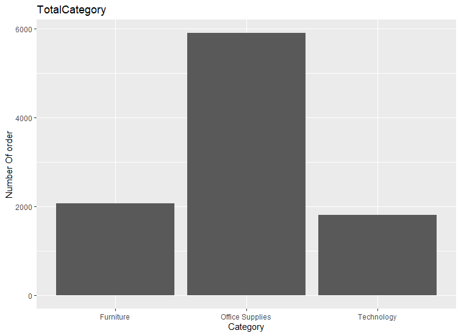
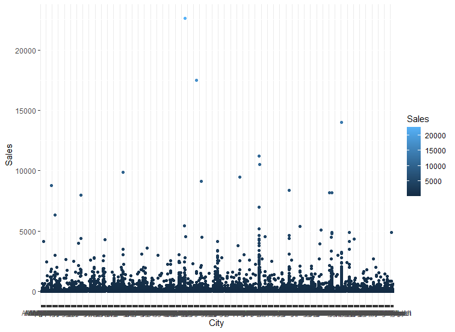

# R-Assignment 4

**Created by Chayakorn-Ngamoranlerd (ID: 63130500017)**

Choose Dataset:
2. Superstore Sales Dataset (Data from Rohit Sahoo,[Kaggle](https://www.kaggle.com/rohitsahoo/sales-forecasting)) >> [Using CSV](https://raw.githubusercontent.com/safesit23/INT214-Statistics/main/datasets/superstore_sales.csv)


### Outlines
1. Explore the dataset
2. Learning function from Tidyverse
3. Transform data with dplyr and finding insight the data
4. Visualization with GGplot2

## Part 1: Explore the dataset

```
# Library
library(dplyr)
library(ggplot2)
library(readr)

# Dataset
superstore_sales <- read.csv("https://raw.githubusercontent.com/safesit23/INT214-Statistics/main/datasets/superstore_sales.csv")
```

In this dataset has 9800 rows and 18 colums like Row.Id,Order.Id ,Order.Date ,Ship.Date ,Ship.Mode ,Customer.ID ,Customer.Name ,Segment ,Country ,City , State ,Postal.Code ,Region , Product.ID , Category , Sub.Category ,Product,Name and Sales


## Part 2: Learning function from Tidyverse

- Function `map()` from package [purr](https://purrr.tidyverse.org/reference/map.html)). It using for apply function for each element of a list

```
string1 <- c("a","b","c")
string1 %>% map(function(x) x = "c");
```
ouput
[[1]]
[1] "c"

[[2]]
[1] "c"

[[3]]
[1] "c"

## Part 3: Transform data with dplyr and finding insight the data

- Find max sales on order in 2017

```
superstore_sales %>% filter(format(as.Date(Ship.Date, format="%d/%m/%Y"),"%Y") == 2017) %>% select(Sales) %>% max()
```

Result:

```
> superstore_sales %>% filter(format(as.Date(Ship.Date, format="%d/%m/%Y"),"%Y") == 2017) %>% select(Sales) %>% max()
[1] 17499.95
```
- Find number data of this data set

```
superstore_sales %>% count()
```

Result:

```
> superstore_sales %>% count()
     n
1 9800
```

- Find minimal sales of this dataset

```
superstore_sales$Sales %>% min()
```

Result:

```
> superstore_sales$Sales %>% min()
[1] 0.444
```

- Find number of region of this dataset

```
superstore_sales %>% distinct(Region) %>% count()
```

Result:

```
> superstore_sales %>% distinct(Region) %>% count()
  n
1 4
```
- Find number of data in Kentucky state in this dataset

```
superstore_sales %>% filter(State == "Kentucky") %>% count()
```

Result:

```
> superstore_sales %>% filter(State == "Kentucky") %>% count()
    n
1 137
```
- Find minimal sales on furniture category

```
superstore_sales %>% filter(Category == "Furniture") %>% select(Sales) %>% min()
```

Result:

```
> superstore_sales %>% filter(Category == "Furniture") %>% select(Sales) %>% min()
[1] 1.892
```
## Part 4: Visualization with GGplot2
### 1.) Graph show relation between height and mass
```
superstore_sales %>% ggplot(aes(x=Category)) + geom_bar()+ggtitle("TotalCategory") + ylab("Number Of order")
```
Result:



````
superstore_sales %>% ggplot(aes(x=City,y=Sales)) + geom_point(aes(color=Sales))
````
Result:

