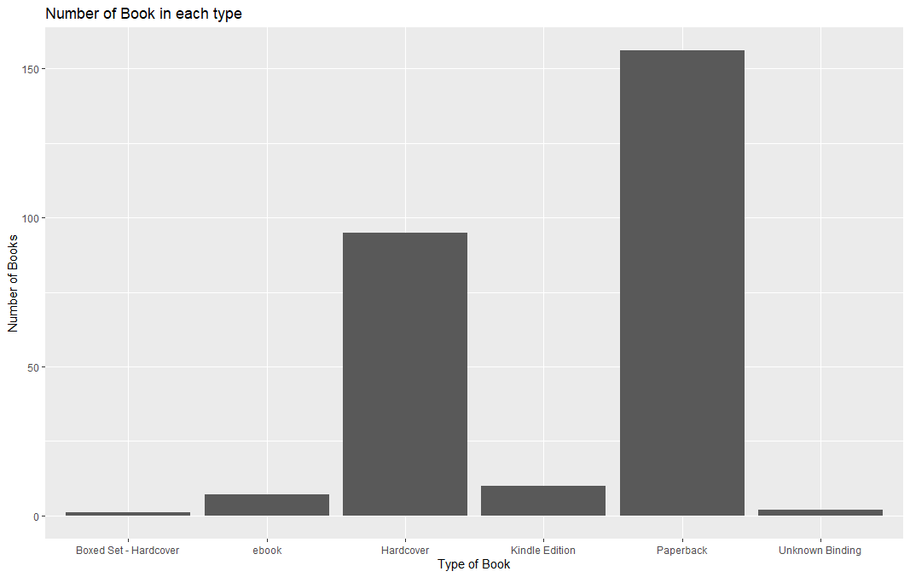
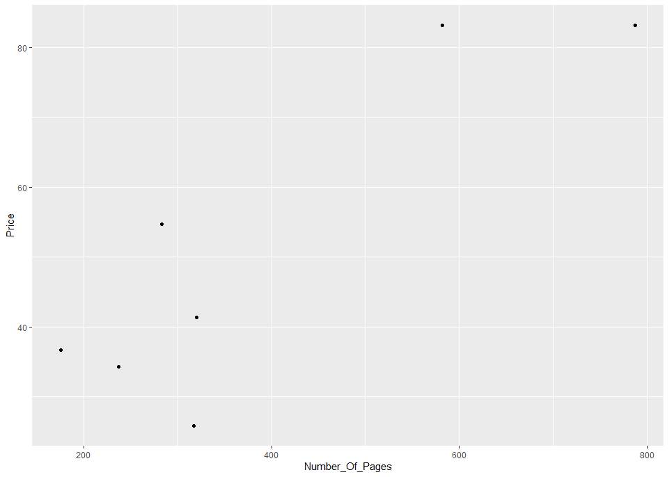

# R-Assignment 4

**Created by Name-Surname (ID: xxxxxxxxxx)**

Choose Dataset: Top 270 Computer Science / Programing Books (Data from Thomas Konstantin, [Kaggle](https://www.kaggle.com/thomaskonstantin/top-270-rated-computer-science-programing-books)) >> [Using CSV](https://raw.githubusercontent.com/safesit23/INT214-Statistics/main/datasets/prog_book.csv)

### Outlines
1. Explore the dataset
2. Learning function from Tidyverse
3. Transform data with dplyr and finding insight the data
4. Visualization with GGplot2

## Part 1: Explore the dataset

```
# Library
library(dplyr)
library(readr)
library(stringr)
install.packages("ggplot2")
library(ggplot2)

# Dataset
topBooks <- read.csv("https://raw.githubusercontent.com/safesit23/INT214-Statistics/main/datasets/prog_book.csv")

```

ภายใน dataset ประกอบไปด้วยข้อมูลจำนวน 271 ข้อมูล และ 7 คอลัมน์


## Part 2: Learning function from Tidyverse

- Function `desc(x)` จาก package [dplyr](https://dplyr.tidyverse.org/reference/desc.html). ใช้ในการแปลง vector ให้อยู่ในรูปแบบการจากจัดเรียงจากมากไปน้อย ในที่นี้ x ก็คือ vector ที่จะใช้แปลง โดย Function นี้สามารถนำมาใช้งานคู่กับ  `arrange()` ได้

```
#แบบที่1
desc(1:10)

#แบบที่2
starwars %>% arrange(desc(mass))

```
Result: ผลลัพธ์ที่เกิดขึ้นทั้ง 2 รูปแบบ จะเกิดการจัดเรียงข้อมูลใหม่จากมากไปหาน้อย

```
#แบบที่1
#>  [1]  -1  -2  -3  -4  -5  -6  -7  -8  -9 -10

#แบบที่2
#> # A tibble: 87 x 14
#>    name    height  mass hair_color  skin_color eye_color birth_year sex   gender
#>    <chr>    <int> <dbl> <chr>       <chr>      <chr>          <dbl> <chr> <chr> 
#>  1 Jabba …    175  1358 NA          green-tan… orange         600   herm… mascu…
#>  2 Grievo…    216   159 none        brown, wh… green, y…       NA   male  mascu…
#>  3 IG-88      200   140 none        metal      red             15   none  mascu…
#>  4 Darth …    202   136 none        white      yellow          41.9 male  mascu…
#>  5 Tarfful    234   136 brown       brown      blue            NA   male  mascu…
#>  6 Owen L…    178   120 brown, grey light      blue            52   male  mascu…
#>  7 Bossk      190   113 none        green      red             53   male  mascu…
#>  8 Chewba…    228   112 brown       unknown    blue           200   male  mascu…
#>  9 Jek To…    180   110 brown       fair       blue            NA   male  mascu…
#> 10 Dexter…    198   102 none        brown      yellow          NA   male  mascu…
#> # … with 77 more rows, and 5 more variables: homeworld <chr>, species <chr>,
#> #   films <list>, vehicles <list>, starships <list>

```

## Part 3: Transform data with dplyr and finding insight the data

1.ราคาเฉลี่ยของหนังสือทั้งหมดเป็นเท่าไหร่

```
topBooks$Price %>% mean()
```

Result:

```
[1] 54.54186
```
หนังสือทั้งหมดมีราคาเฉลี่อยู่ที่ 54.54186

2.หนังสือโดยเฉลี่ยแล้วมีทั้งกี่หน้า

```
mean(topBooks$Number_Of_Pages)
```

Result:

```
[1] 475.0775
```
หนังสือทั้งหมดมีจำนวนหน้าโดยเฉลี่ยเป็น 475.0775 หน้า

3.หนังสือที่มีจำนวนหน้ามากที่สุดและน้อยที่สุดคือหนังสือเล่นใด มีราคาเท่าไหร่ และหนังสือนั้นมีกี่หน้า

```
#หนังสือที่จำนวนหน้ามากที่สุด
topBooks %>% filter(Number_Of_Pages==max(Number_Of_Pages)) %>% select(Book_title,Price,Number_Of_Pages)

#หนังสือที่จำนวนหน้าน้อยที่สุด
topBooks %>% filter(Number_Of_Pages==min(Number_Of_Pages)) %>% select(Book_title,Price,Number_Of_Pages)
```

Result:

```
#หนังสือที่จำนวนหน้ามากที่สุด
                                              Book_title       Price     Number_Of_Pages
1 The Art of Computer Programming, Volumes 1-4a Boxed Set   220.3853                3168

#หนังสือที่จำนวนหน้าน้อยที่สุด
                                    Book_title       Price     Number_Of_Pages
1 Responsive Web Design Overview For Beginners     11.26765                50
```
- หนังสือเล่มที่มีจำนวนหน้ามากที่สุดคือ The Art of Computer Programming, Volumes 1-4a Boxed Set โดยมีราคา 220.3853 และจำนวนหน้าอยู่ที่ 3168 หน้า
- หนังสือเล่มที่มีจำนวนหน้าน้อยที่สุดคือ Responsive Web Design Overview For Beginners โดยมีราคา 11.26765 และจำนวนหน้าอยู่ที่ 50 หน้า

4.ในหนังสือแต่ละประเภท(type) หนังสือเล่มใดที่มีความนิยมสูงสุด

```
topBooks %>% select(Rating,Book_title,Type) %>% group_by(Type) %>% filter(Rating == max(Rating)) %>% select(Book_title,Rating)
```

Result:

```
Type                    Book_title                                                       Rating
#<chr>                  <chr>                                                            <dbl>
#1 ebook                 Your First App: Node.js                                         5   
#2 Kindle Edition        The Principles of Object-Oriented JavaScript                    4.35
#3 Unknown Binding       How to Think Like a Computer Scientist: Learning with Python    4.11
#4 Paperback             Designing Data-Intensive Applications: The Big Ideas Behind ~   4.72
#5 Boxed Set - Hardcover The Art of Computer Programming, Volumes 1-3 Boxed Set          4.49
#6 Hardcover             The Art of Computer Programming, Volumes 1-4a Boxed Set         4.77
```
- ประเภท ebook หนังสือที่ได้รับความสูงสุดคือ Your First App: Node.js
- ประเภท Kindle Edition หนังสือที่ได้รับความสูงสุดคือ The Principles of Object-Oriented JavaScript
- ประเภท Unknown Binding  หนังสือที่ได้รับความสูงสุดคือ How to Think Like a Computer Scientist: Learning with Python
- ประเภท Paperback หนังสือที่ได้รับความสูงสุดคือ Designing Data-Intensive Applications: The Big Ideas Behind ~
- ประเภท Boxed Set - Hardcover หนังสือที่ได้รับความสูงสุดคือ The Art of Computer Programming, Volumes 1-3 Boxed Set
- ประเภท Hardcover หนังสือที่ได้รับความสูงสุดคือ The Art of Computer Programming, Volumes 1-4a Boxed Set

5.ชื่อหนังสือเล่มใดบ้างที่มีคำว่า Network

```
str_subset(topBooks$Book_title,"Network")
```

Result:

```
#[1] "Make Your Own Neural Network: An In-depth Visual Introduction For Beginners"
#[2] "High Performance Browser Networking"                                        
#[3] "Make Your Own Neural Network"                                               
#[4] "Communication Networks: Fundamental Concepts and Key Architectures"     

```
หนังสือเหล่านี้เป็นหนังสือที่มีชื่อเรื่องเกี่ยวกับ Network
- "Make Your Own Neural Network: An In-depth Visual Introduction For Beginners"
- "High Performance Browser Networking"   
- "Make Your Own Neural Network" 
- "Communication Networks: Fundamental Concepts and Key Architectures"

6.หนังสือที่ได้รับความนิยมสูงสุดคือเล่มใด และมีเรทติ้ง จำนวนคนรีวิว ชนิดของหนังสือ และราคาเท่าใด

```
topBooks %>% filter(Rating==max(Rating)) %>% select(Book_title,Rating,Reviews,Type,Price)
```

Result:

```
                Book_title       Rating      Reviews       Type        Price
#1 Your First App: Node.js            5            0      ebook     25.85588
```
หนังสือที่ได้รัความนิยมสูงสุดคือ Your First App: Node.js ซึ่งมีเรทติ้งอยู่ที่ 5 ในขณะที่จำนวนคนรีวิวเป็น 0 และเป็นหนังสือประเภท ebook ที่มีราคา 25.85588

## Part 4: Visualization with GGplot2
### 1.) กราฟแสดงความสัมพันธ์ระหว่างชนิดของหนังสือกับจำนวนของหนังสือในแต่ละชนิด
```
numberOfBooks_eachType <- table(topBooks$Type)
ggplot(topBooks,aes(x=Type))+geom_bar()+ggtitle("Number of Book in each type")+xlab("Type of Book")+ylab("Number of Books")

```
Result:



### 2.) กราฟแสดงความสัมพันธ์ระหว่างราคากับจำนวนหน้าของหนังสือประเภท ebook
```
eBook<-topBooks %>% filter(topBooks$Type == "ebook") 
eBook %>% ggplot(aes(x=Number_Of_Pages,y=Price))+geom_point()

```
Result:




